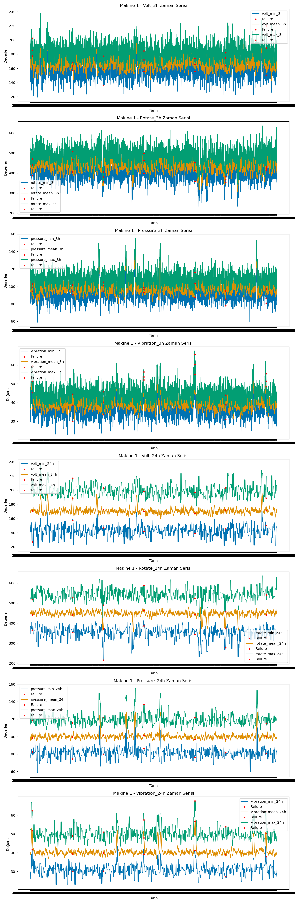
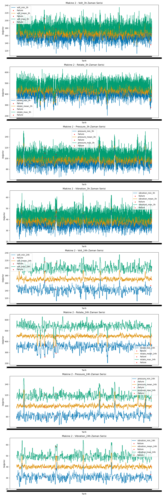
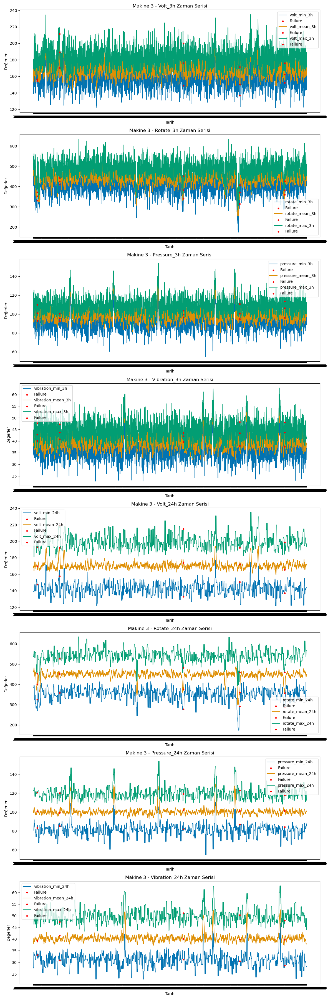
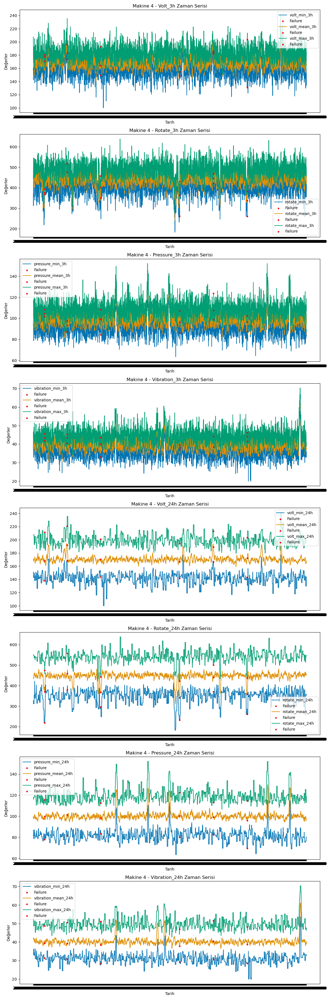
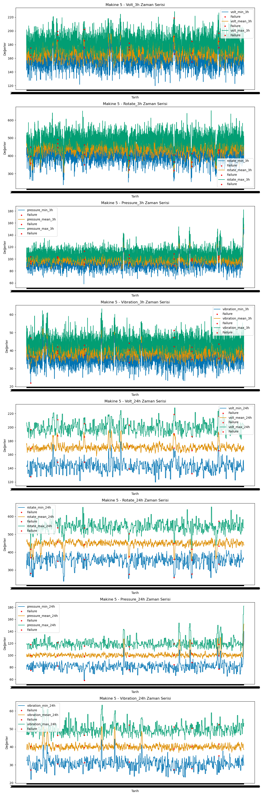

# Predict Machine Failures Using Machine Learning

This project aims to develop a machine learning model to predict machine failures based on various sensor readings and failure counts. Using historical sensor data and failure logs, a model was created to accurately forecast machine malfunctions.

---

## Project Overview

### Data Preprocessing
- Data cleaning, transformation, and handling of missing values were performed.  
- Exploratory Data Analysis (EDA) and time series analysis were conducted.

### Feature Engineering
- New features were derived using sensor readings and failure counts to improve model performance.

### Model Selection and Hyperparameter Tuning
- Various machine learning algorithms were tested.  
- The best-performing models were selected based on accuracy and predictive power.

### Hybrid Model
- A hybrid approach combining two algorithms was implemented.  
- Gradient Boosting and Bagging Classifier were used together to enhance prediction accuracy.

---

## Project Files

| File | Description |
|------|-------------|
| `data_preprocess_EDA.ipynb` | Data preprocessing and exploratory visual analysis (EDA) |
| `data_preprocess_timeseries_featureengineering.ipynb` | Feature engineering and time series analysis |
| `model_creator.ipynb` | Various algorithms applied to processed data; best models, hyperparameters, and features identified |
| `final_model_create.ipynb` | Final model created using selected features, algorithms, and parameters |
| `machine_predict.py` | Takes raw data in `Makine_verileri.csv` format and outputs predictions |

---

## Model Details
- The trained model predicts encoded target variables: `failure_none`, `failure_comp1`, `failure_comp2`, and `failure_comp4`.  
- The hybrid model combines Gradient Boosting and Bagging Classifier to achieve more accurate predictions.

---

## Example Visualizations

**Machine 1**  

**Machine 2**  

**Machine 3**  

**Machine 4**  

**Machine 5**  

---

Created by **Kerim Birtem**

# Makine Arızalarını Makine Öğrenmesi ile Tahmin Etme

Bu proje, çeşitli sensör verileri ve arıza sayımlarına dayalı olarak makine arızalarını tahmin etmek için bir makine öğrenme modeli geliştirmeyi amaçlamaktadır. Geçmiş sensör verileri ve arıza kayıtları kullanılarak, makinelerde oluşabilecek arızaları doğru şekilde tahmin eden bir model oluşturulmuştur.

---

## Proje İçeriği

### Veri Ön İşleme
- Veriler üzerinde temizlik, dönüşüm ve eksik değerlerin işlenmesi gibi işlemler yapılmıştır.  
- Veri keşfi (EDA) ve zaman serisi analizleri gerçekleştirilmiştir.

### Özellik Mühendisliği
- Sensör verileri ve arıza sayımları kullanılarak model performansını artıracak yeni özellikler türetilmiştir.

### Model Seçimi ve Hiperparametre Analizi
- Çeşitli makine öğrenme algoritmaları denenmiş ve doğruluk ve tahmin gücüne göre en iyi modeller seçilmiştir.

### Hibrit Model
- İki algoritmayı birleştiren hibrit bir model geliştirilmiştir.  
- Gradient Boosting ve Bagging Classifier birlikte kullanılarak tahmin doğruluğu artırılmıştır.

---

## Çalışma Dosyaları

| Dosya | Açıklama |
|-------|----------|
| `data_preprocess_EDA.ipynb` | Veri ön işleme ve görsel veri keşfi (EDA) |
| `data_preprocess_timeseries_featureengineering.ipynb` | Özellik mühendisliği ve zaman serisi analizi |
| `model_creator.ipynb` | İşlenmiş veriler üzerinde çeşitli algoritmalar uygulanmış; en iyi modeller, hiperparametreler ve özellikler belirlenmiş |
| `final_model_create.ipynb` | Seçilen özellikler, algoritmalar ve parametreler kullanılarak nihai model oluşturulmuş |
| `machine_predict.py` | `Makine_verileri.csv` formatındaki ham veriyi alır ve tahmin sonuçlarını üretir |

---

## Model Detayları
- Eğitilen model, encode edilmiş hedef değişkenleri tahmin eder: `failure_none`, `failure_comp1`, `failure_comp2`, ve `failure_comp4`.  
- Hibrit model, Gradient Boosting ve Bagging Classifier kombinasyonu ile daha doğru tahminler sağlar.
